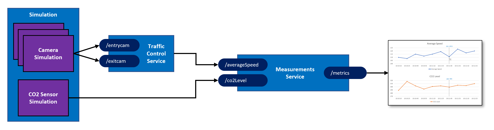
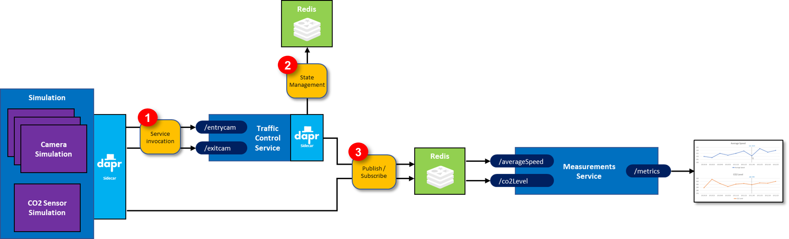

# Info Support in-house event workshop

This repo contains a workshop that teaches you how to apply Dapr to a microservices application. This repository contains the source-code that forms the starting point of the workshop. During the workshop you will have to add new services to the solution and integrate these into the solution using Dapr.

## Prerequisites

In order to get most value out of the workshop, make sure you have the prerequisites installed on your machine before the workshop starts. Install the General prerequisites first. Then, select the technology stack you are going to use for executing the workshop assignments and install the prerequisites for that technology stack.

#### General

- Git ([download](https://git-scm.com/))
- Visual Studio Code ([download](https://code.visualstudio.com/download)) with at least the following extensions installed:
  - [REST Client](https://marketplace.visualstudio.com/items?itemName=humao.rest-client)
- Docker for desktop ([download](https://www.docker.com/products/docker-desktop))
- [Install the Dapr CLI](https://docs.dapr.io/getting-started/install-dapr-cli/) and [initialize Dapr locally](https://docs.dapr.io/getting-started/install-dapr-selfhost/)

All scripts in the instructions are PowerShell scripts. If you're working on a Mac, it is recommended to install PowerShell for Mac:

- PowerShell for Mac ([instructions](https://docs.microsoft.com/nl-nl/powershell/scripting/install/installing-powershell-core-on-macos?view=powershell-7.1))

#### .NET

When you want to work in .NET / C#:

- .NET 7 SDK ([download](https://dotnet.microsoft.com/download/dotnet/7.0))
- [C# extension for Visual Studio Code](https://marketplace.visualstudio.com/items?itemName=ms-dotnettools.csharp)

#### Java

When you want to work in Java:

- Java 17 or above ([download](https://adoptopenjdk.net/?variant=openjdk17))
- [Visual Studio Code Extension Pack for Java](https://marketplace.visualstudio.com/items?itemName=vscjava.vscode-java-pack)
- Apache Maven 3.6.3 or above is required; Apache Maven 3.8.1 is advised ([download](http://maven.apache.org/download.cgi))
  - Make sure that Maven uses the correct Java runtime by running `mvn -version`.

## Case Setup

This is an overview of the fictitious setup I'm simulating in this sample:

There is a stretch of highway that is equipped with camera's. There's 1 entry-camera and 1 exit-camera per lane. When a vehicle passes an entry-camera, the license-number of the vehicle and the timestamp is registered.

When the car passes an exit-camera, this timestamp is also registered and the average speed of the vehicle based on the entry- and exit-timestamp is calculated.

Next to the highway, there is a CO2 sensor. This sensor will measure the amount of CO2 in the air surrounding the highway once every minute.

Using the overall average speed and CO2 levels over time, we can get investigate whether the average speed on a highway is correlated to the CO2 level  in the air. 

## Simulation

In order to simulate this in code, I created the following services:

- The **Simulation** is a .NET console application that will simulate the 3 entry- and exit-camera's with cars passing under them and the CO2 level sensor.
- The **Traffic Control Service** is an ASP.NET WebAPI application that offers 2 endpoints: `/entrycam` and `/exitcam`.
- The **Measurements Service** is an ASP.NET Core WebAPI application that offers 3 endpoints: `/averageSpeed`, `/co2Level` and `/metrics`.

The way the simulation works is depicted in the sequence diagram below:

1. The **Camera Simulation** generates a random license-number and sends a *VehicleRegistered* message (containing this license-number, a random entry-lane (1-3) and the timestamp) to the `/entrycam` endpoint of the **TrafficControl Service**.
1. The **TrafficControl Service** stores the VehicleState (license-number and entry-timestamp).
1. After some random interval, the **Camera Simulation** sends a *VehicleRegistered* message to the `/exitcam` endpoint of the **TrafficControl Service** (containing the license-number generated in step 1, a random exit-lane (1-3) and the exit timestamp).
1. The **TrafficControl Service** retrieves the VehicleState that was stored at vehicle entry.
1. The **TrafficControl Service** calculates the average speed of the vehicle using the entry- and exit-timestamp. It also stores the VehicleState with the exit timestamp for audit purposes, but this is left out of the sequence diagram for clarity.
1. The average speed is sent to the `/averageSpeed` endpoint of the **Measurements Service**. The request payload will be an *AverageSpeedmeasured* message containing the average speed in KMh of a vehicle and the timestamp of the measurement.
1. The **Measurements Service** calculates the overall average speed over time since the last sample point (see 9) and stores this.
1. Every 15 seconds, the **CO2 Sensor Simulation** reads the current level of CO2 in the air and sends this to the `/co2Level` endpoint of the **Measurements Service**. The request payload will be a *CO2LevelMeasured* message containing the the amount of CO2 in the air expressed in parts per million (ppm) and the timestamp of the measurement. 
1. The **Measurements Service** generates a *sample point*. A sample point is a measurement at a point in time that contains a timestamp, the average speed over time since the last sample point and the CO2 level at that point in time.
1. The **Dashboard** gets all the sample points by calling the metrics endpoint of the of the **Measurements Service**. The **Measurements Service** returns the last 50 sample points. This data can be used to create a dashboard that will plot the average speed and CO2 level in a graph:

## Hands-on Workshop

TODO

### Assignment 1

### Assignment 2

### Assignment 3

